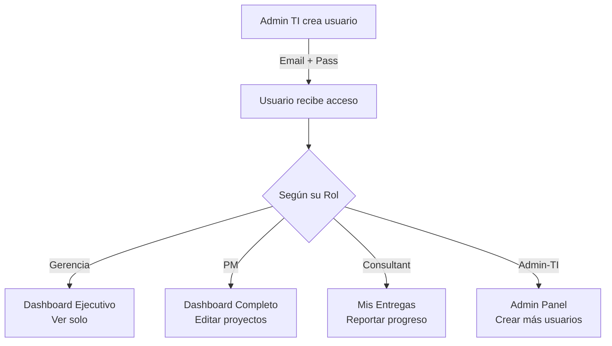

# 🔐 Usuarios y Roles - InnoTeam PMO

## ✅ Status: Actualizado 2 de Julio 2026

Todos los usuarios están creados en Supabase y funcionales en producción.

---

## 🎭 4 Roles del Sistema

### 1️⃣ **GERENCIA** (Visualización)
**Acceso:** Solo lectura - Dashboards ejecutivos

| Campo | Valor |
|-------|-------|
| **Email** | `gerencia@innoteam.com` |
| **Contraseña** | `Gerencia123!` |
| **Rol** | `gerencia` |

**Permisos:**
- ✅ Ver dashboard ejecutivo (KPIs, gráficos)
- ✅ Ver proyectos y entregables
- ✅ Ver alertas críticas
- ✅ Exportar reportes (PDF/Excel)
- ❌ No puede editar ni crear nada

---

### 2️⃣ **PROJECT MANAGER** (PM)
**Acceso:** Gestión de proyectos

| Campo | Valor |
|-------|-------|
| **Email** | `pm@innoteam.com` |
| **Contraseña** | `PM123!` |
| **Rol** | `pm` |

**Permisos:**
- ✅ Crear proyectos
- ✅ Editar entregables (estado, fase, observaciones)
- ✅ Crear y editar alertas
- ✅ Crear y gestionar acciones
- ✅ Ver todos los datos del proyecto
- ✅ Exportar reportes

---

### 3️⃣ **CONSULTOR FUNCIONAL** (Consultant)
**Acceso:** Captura de datos

| Campo | Valor |
|-------|-------|
| **Email** | `consultant@innoteam.com` |
| **Contraseña** | `Consultant123!` |
| **Rol** | `consultant` |

**Permisos:**
- ✅ Ver sus entregables asignados
- ✅ Registrar observaciones
- ✅ Reportar progreso
- ✅ Actualizar estado de sus entregas
- ❌ No puede ver otros proyectos
- ❌ No puede crear alertas

---

### 4️⃣ **ADMINISTRADOR TI** ⭐ (Admin-TI)
**Acceso:** Administración del sistema

| Campo | Valor |
|-------|-------|
| **Email** | `admin@innoteam.com` |
| **Contraseña** | `Admin123!` |
| **Rol** | `admin-ti` |

**Permisos:**
- ✅ **Crear nuevos usuarios** (NUEVO!)
- ✅ Asignar roles (gerencia, pm, consultant, admin-ti)
- ✅ Ver lista de todos los usuarios
- ✅ Gestionar acceso y permisos
- ✅ Ver auditoría del sistema
- ✅ Acceso total a administración

---

## 🆕 NUEVO: Crear Usuarios (Admin TI)

### Opción 1: Desde la Aplicación Web
1. Login con Admin TI: `admin@innoteam.com` / `Admin123!`
2. Click en ☰ (menu) → **Usuarios** (o **⚙ Administración** → **Usuarios**)
3. Llenar formulario:
   - Email: `nuevo@innoteam.com`
   - Contraseña: (la que el usuario usar)
   - Rol: Elegir (Gerencia, PM, Consultor, Admin TI)
4. Click **Crear Usuario**

### Opción 2: Desde Supabase Dashboard
1. Ve a: https://wlieuqmijhlisdzhujjb.supabase.co
2. **Authentication** → **Users** → **+ Add user**
3. Email y password
4. Editar el usuario:
   - Click en el usuario creado
   - **User Metadata** → Agregar JSON:
   ```json
   {
     "role": "pm",
     "full_name": "Nombre Usuario"
   }
   ```

---

## 📍 URLs Importantes

| Recurso | URL |
|---------|-----|
| **Aplicación** | https://innoteam-pmo.vercel.app |
| **Admin Panel** | https://innoteam-pmo.vercel.app/dashboard/admin |
| **Crear Usuarios** | https://innoteam-pmo.vercel.app/dashboard/admin/users |
| **GitHub** | https://github.com/andersson-astete/innoteam-pmo |
| **Supabase** | https://wlieuqmijhlisdzhujjb.supabase.co |

---

## 🔍 Verificar Rol del Usuario

Cuando haces login, el rol aparece en `user.user_metadata.role`:

```typescript
// En cualquier página 'use client':
const user = await getCurrentUser()
const role = user?.user_metadata?.role
// Valores: 'gerencia' | 'pm' | 'consultant' | 'admin-ti'
```

---

## ✨ Flujo de Onboarding



---

## 📊 Vista Rápida de Diferencias

| Característica | Gerencia | PM | Consultant | Admin TI |
|---|:---:|:---:|:---:|:---:|
| Ver Dashboard | ✅ | ✅ | ✅ | ✅ |
| Editar Proyectos | ❌ | ✅ | ❌ | ✅ |
| Crear Alertas | ❌ | ✅ | ❌ | ✅ |
| Registrar Obs. | ❌ | ✅ | ✅ | ✅ |
| **Crear Usuarios** | ❌ | ❌ | ❌ | ✅ |
| Ver Auditoría | ❌ | ❌ | ❌ | ✅ |

---

## 🆘 Troubleshooting

### "No puedo loguearme"
- ✅ Verifica que el email sea exacto (incluyendo mayúsculas)
- ✅ La contraseña es sensible a mayúsculas/minúsculas
- ✅ Recarga la página después de crear el usuario (dar 10 segundos)

### "No veo opción de crear usuarios"
- ✅ Solo Admin TI (admin@innoteam.com) puede crear usuarios
- ✅ Ve a /dashboard/admin/users
- ✅ Si eres otro rol, pídele al Admin TI que cree tu usuario

### "Cambiar Rol a un usuario"
- ✅ Por ahora, debe hacerlo el Admin TI desde Supabase
- ✅ O eliminar el usuario y crear uno nuevo con el rol correcto

---

## 📝 Notas

- **Passwords:** Cada usuario recibe su propia contraseña segura
- **Metadata:** El rol se almacena en `user_metadata.role` de Supabase Auth
- **Auditoría:** Cada login se registra (próxima feature)
- **MFA:** Próximamente (autenticación de 2 factores)

---

**Fecha última actualización:** 2 de Julio 2026  
**Versión:** 1.0.1 (Con soporte completo de roles y admin)

¿Necesitas ayuda? Contacta al Admin TI. 🔧
